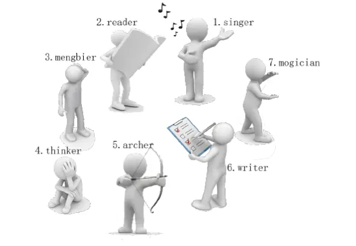
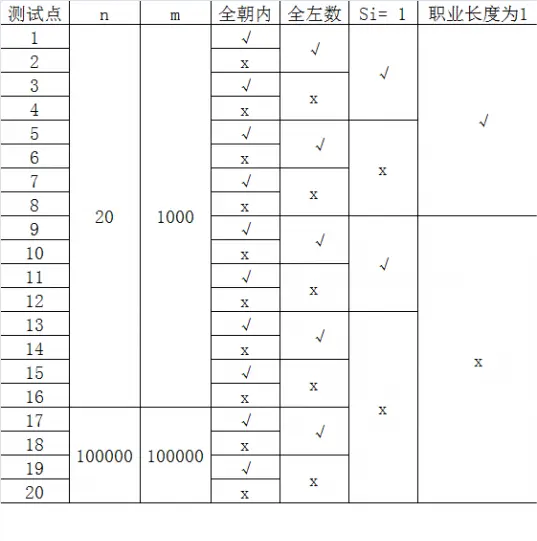

# [NOIP2016 提高组] 玩具谜题

## 题目背景

NOIP2016 提高组 D1T1

## 题目描述

小南有一套可爱的玩具小人，它们各有不同的职业。

有一天，这些玩具小人把小南的眼镜藏了起来。小南发现玩具小人们围成了一个圈，它们有的面朝圈内，有的面朝圈外。如下图：

 

这时 singer 告诉小南一个谜题：“眼镜藏在我左数第 $3$ 个玩具小人的右数第 $1$ 个玩具小人的左数第 $2$ 个玩具小人那里。”

小南发现，这个谜题中玩具小人的朝向非常关键，因为朝内和朝外的玩具小人的左右方向是相反的：面朝圈内的玩具小人，它的左边是顺时针方向，右边是逆时针方向；而面向圈外的玩具小人，它的左边是逆时针方向，右边是顺时针方向。

小南一边艰难地辨认着玩具小人，一边数着:

singer 朝内，左数第 $3$ 个是 archer。

archer 朝外，右数第 $1$ 个是 thinker。

thinker 朝外，左数第 $2$ 个是 writer。

所以眼镜藏在 writer 这里！

虽然成功找回了眼镜，但小南并没有放心。如果下次有更多的玩具小人藏他的眼镜，或是谜题的长度更长，他可能就无法找到眼镜了。所以小南希望你写程序帮他解决类似的谜题。这样的谜題具体可以描述为：

有 $n$ 个玩具小人围成一圈，已知它们的职业和朝向。现在第 $1$ 个玩具小人告诉小南一个包含 $m$ 条指令的谜題，其中第 $z$ 条指令形如“向左数/右数第 $s$ 个玩具小人”。你需要输出依次数完这些指令后，到达的玩具小人的职业。

## 输入格式

输入的第一行包含两个正整数 $n,m$，表示玩具小人的个数和指令的条数。

接下来 $n$ 行，每行包含一个整数和一个字符串，以逆时针为顺序给出每个玩具小人的朝向和职业。其中 $0$ 表示朝向圈内，$1$ 表示朝向圈外。保证不会出现其他的数。字符串长度不超过 $10$ 且仅由英文字母构成，字符串不为空，并且字符串两两不同。整数和字符串之间用一个空格隔开。

接下来 $m$ 行，其中第 $i$ 行包含两个整数 $a_i,s_i$，表示第 $i$ 条指令。若 $a_i=0$，表示向左数 $s_i$ 个人；若 $a_i=1$，表示向右数 $s_i$ 个人。 保证 $a_i$ 不会出现其他的数，$1 \le s_i < n$。

## 输出格式

输出一个字符串，表示从第一个读入的小人开始，依次数完 $m$ 条指令后到达的小人的职业。

## 样例 #1

### 样例输入 #1

```
7 3
0 singer
0 reader
0 mengbier 
1 thinker
1 archer
0 writer
1 mogician 
0 3
1 1
0 2
```

### 样例输出 #1

```
writer
```

## 样例 #2

### 样例输入 #2

```
10 10
1 C
0 r
0 P
1 d
1 e
1 m
1 t
1 y
1 u
0 V
1 7
1 1
1 4
0 5
0 3
0 1
1 6
1 2
0 8
0 4
```

### 样例输出 #2

```
y
```

## 提示

**样例 1 说明**

这组数据就是【题目描述】中提到的例子。


**子任务**

子任务会给出部分测试数据的特点。如果你在解决题目中遇到了困难，可以尝试只解决一部分测试数据。

每个测试点的数据规模及特点如下表:

 

其中一些简写的列意义如下:

- 全朝内：若为 $\surd$，表示该测试点保证所有的玩具小人都朝向圈内；

- 全左数：若为 $\surd$，表示该测试点保证所有的指令都向左数，即对任意的 $1\leq z\leq m, a_i=0$；

- $s=1$：若为 $\surd$，表示该测试点保证所有的指令都只数 $1$ 个，即对任意的 $1\leq z\leq m,s_i=1$；

职业长度为 $1$：若为 $\surd$，表示该测试点保证所有玩具小人的职业一定是一个长度为 $1$ 的字符串。