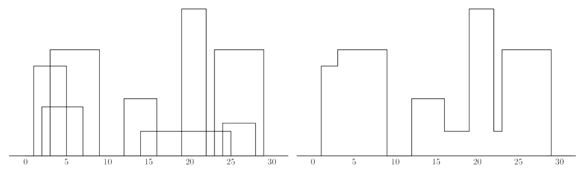

# 山脉轮廓

## 题目描述

在一个遥远的大陆上，有一片神秘而无人居住的山脉区域。探险家小 Z 被委派去勘测这片区域的地形，并绘制出山脉的轮廓图。为了让远在他乡的研究团队了解这片区域的地形，小 Z 需要描述出山脉的轮廓。

山脉的地形可以简化为一系列的山峰，每个山峰用一个三元组 $(L_i,H_i,R_i)$ 来描述，其中 $L_i$ 和 $R_i$ 分别是山峰的起始和结束横坐标，$H_i$ 是山峰的高度。在下方所示的图中，左边的山峰描述如下 $(1,11,5)$，$(2,6,7)$，$(3,13,9)$，$(12,7,16)$，$(14,3,25)$，$(19,18,22)$，$(23,13,29)$，$(24,4,28)$，右边用轮廓线的顺序 $(1,11,3,13,9,0,12,7,16,3,19,18,22,3,23,13,29,0)$ 表示：




注意：被重复覆盖的区域的面积只算一次。

## 输入格式

输入数据中包含一系列表示山峰的三元组。所有山峰的坐标值都是小于 $10000$ 的正整数，至少有 $1$ 座山峰，最多有 $5000$ 座山峰。在输入中，每个山峰的三元组各占一行，三元组中的所有整数由一个或多个空格分开。

## 输出格式

输出数据要求给出山脉的轮廓线。对于所有轮廓线上的折点，按顺序排列，第奇数个点输出 $x$ 坐标，第偶数个点输出 $y$ 坐标，两个数之间用空格分开。

## 样例 #1

### 样例输入 #1

```
1 11 5
2 6 7
3 13 9
12 7 16
14 3 25
19 18 22
23 13 29
24 4 28
```

### 样例输出 #1

```
1 11 3 13 9 0 12 7 16 3 19 18 22 3 23 13 29 0
```

## 提示